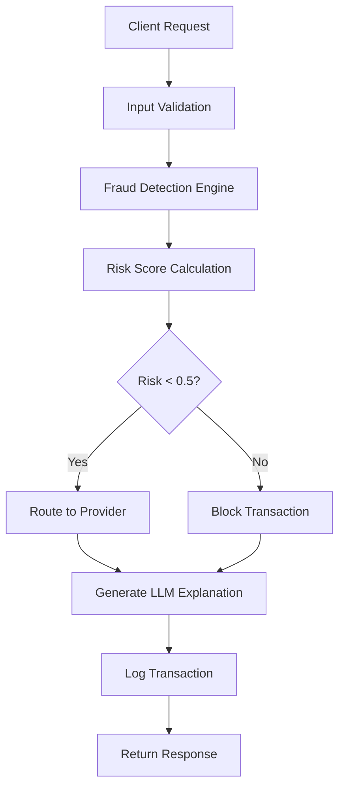
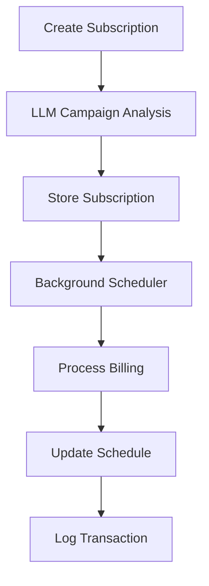

# NestJS Payment Gateway & Subscription Billing Simulator

A production-ready NestJS application featuring two powerful modules:

1. **Payment Gateway Proxy** - Advanced fraud detection with LLM-powered explanations
2. **Subscription Billing Simulator** - Automated donation processing with campaign analysis

## 🚀 Quick Start

### Prerequisites

- **Docker & Docker Compose**
- **Git**

### 1. Clone and Setup

```bash
git clone <repository-url>
cd Persistent_Assessment
```

### 2. Environment Configuration

```bash
# Copy environment template
cp env.example .env
```

**Required Environment Variables:**
```env
# Server Configuration
PORT=3000
NODE_ENV=development

# LLM Configuration
LLM_API_URL=http://ollama:11434
LLM_MODEL=tinyllama

# Fraud Detection Configuration
RISK_BLOCK_THRESHOLD=0.5
RISK_AMOUNT_THRESHOLD=1000
```

### 3. Build and Run with Docker Compose

```bash
# Build and start all services (Backend + Ollama LLM)
docker-compose up --build -d

# Check if services are running
docker-compose ps

# View logs
docker-compose logs -f
```

### 4. Access the Application

- **🌐 API Base URL**: http://localhost:3000
- **📚 Swagger Documentation**: http://localhost:3000/docs
- **🏥 Health Check**: http://localhost:3000/health
- **👋 Hello World**: http://localhost:3000/hello
- **🏠 Root**: http://localhost:3000/ (shows "NestJS app is running!")

### 5. Verify Installation

```bash
# Test root endpoint
curl http://localhost:3000/

# Test health endpoint
curl http://localhost:3000/health

# Test hello endpoint
curl http://localhost:3000/hello

# Test payment endpoint (API versioned)
curl -X POST http://localhost:3000/api/v1/payments/charge \
  -H "Content-Type: application/json" \
  -d '{"amount": 100, "currency": "USD", "source": "tok_test", "email": "test@example.com", "ipCountry": "US", "billingCountry": "US"}'
```

### 5. Stop the Application

```bash
# Stop all services
docker-compose down

# Stop and remove volumes (clears all data)
docker-compose down -v
```

## 🏗️ Architecture Overview

```
┌─────────────────┐    ┌──────────────────┐    ┌─────────────────┐
│   Client/API    │───▶│  NestJS Backend  │───▶│   Ollama LLM    │
│   (Swagger UI)  │    │   (Docker)       │    │   (Docker)      │
└─────────────────┘    └──────────────────┘    └─────────────────┘
                              │
                              ▼
                       ┌──────────────────┐
                       │  In-Memory Log   │
                       │  (Transactions)  │
                       └──────────────────┘
```

## 🔄 Application Flow

### Payment Gateway Flow



### Subscription Billing Flow



## 💳 Payment Gateway Module

### Fraud Detection Heuristics

| Heuristic | Trigger Condition | Risk Increment | Description |
|-----------|------------------|----------------|-------------|
| **Large Amount** | Amount > $1000 | +0.3 | High-value transactions |
| **Suspicious Domain** | Email domain in blacklist | +0.3 | Known fraud domains |
| **Velocity** | >3 charges/hour from same email | +0.25 | Rapid-fire transactions |
| **Geolocation Mismatch** | IP country ≠ Billing country | +0.2 | Location inconsistency |

### Risk Scoring Logic

```javascript
// Base risk score
let riskScore = 0.1;

// Apply heuristics
if (amount > RISK_AMOUNT_THRESHOLD) riskScore += 0.3;
if (isSuspiciousDomain(email)) riskScore += 0.3;
if (getChargeCount(email, 1) > 3) riskScore += 0.25;
if (ipCountry !== billingCountry) riskScore += 0.2;

// Decision logic
const status = riskScore < 0.5 ? 'success' : 'blocked';
const provider = status === 'success' ? getRandomProvider() : null;
```

## 📅 Subscription Billing Module

### Features
- **LLM Campaign Analysis**: Automatic tag generation and summaries
- **Automated Billing**: Background scheduler processes subscriptions
- **Multiple Intervals**: Weekly, monthly, yearly billing cycles
- **Statistics**: Comprehensive analytics and reporting

### Billing Scheduler
- **Interval**: 60 seconds
- **Batch Processing**: Processes multiple subscriptions concurrently
- **Error Handling**: Graceful failure handling and retry logic

## 📄 API Endpoints

### Basic Endpoints (Root Level)
These endpoints are available at the root level for simple testing and verification:

#### GET /
Basic health check to verify NestJS is running.
**Response**: `"NestJS app is running!"`

#### GET /hello
Simple hello world endpoint.
**Response**: `"Hello World!"`

#### GET /health
Detailed health status of the application.
**Response**:
```json
{
  "status": "healthy",
  "timestamp": "2024-01-15T10:30:00Z",
  "version": "1.0.0"
}
```

### API Versioned Endpoints
These endpoints are under `/api/v1/` prefix and include the main application functionality:

### Payment Gateway Endpoints

#### POST /api/v1/payments/charge
Process a payment with fraud detection.

**Request:**
```json
{
  "amount": 100,
  "currency": "USD",
  "source": "tok_test",
  "email": "user@example.com",
  "ipCountry": "US",
  "billingCountry": "US"
}
```

**Success Response (200):**
```json
{
  "transactionId": "txn_abc123",
  "provider": "stripe",
  "status": "success",
  "riskScore": 0.25,
  "explanation": "Payment routed to Stripe due to low risk score.",
  "timestamp": "2024-01-15T10:30:00Z",
  "amount": 100,
  "currency": "USD",
  "email": "user@example.com"
}
```

#### GET /api/v1/payments/transactions
Retrieve all processed transactions.

### Subscription Billing

#### POST /api/v1/subscriptions
Create a new subscription.

**Request:**
```json
{
  "donorId": "abc123",
  "amount": 1500,
  "currency": "USD",
  "source": "tok_test",
  "email": "donor@example.com",
  "interval": "monthly",
  "campaignDescription": "Emergency food and clean water for earthquake victims in Nepal"
}
```

#### DELETE /api/v1/subscriptions/:donorId
Cancel an active subscription.

#### GET /api/v1/subscriptions
Retrieve all subscriptions.

#### GET /api/v1/subscriptions/active
Retrieve only active subscriptions.

#### GET /api/v1/subscriptions/statistics/overview
Retrieve subscription statistics.

#### POST /api/v1/subscriptions/billing/trigger
Manually trigger billing processing.

### Health & Status

#### GET /api/v1/health
Check application health status.

## 🧪 Testing

### Quick Test Commands

```bash
# Test basic endpoints
curl http://localhost:3000/
curl http://localhost:3000/hello
curl http://localhost:3000/health

# Test payment processing (API versioned)
curl -X POST http://localhost:3000/api/v1/payments/charge \
  -H "Content-Type: application/json" \
  -d '{"amount": 100, "currency": "USD", "source": "tok_test", "email": "test@example.com", "ipCountry": "US", "billingCountry": "US"}'

# Create subscription (API versioned)
curl -X POST http://localhost:3000/api/v1/subscriptions \
  -H "Content-Type: application/json" \
  -d '{"donorId": "test123", "amount": 1500, "currency": "USD", "source": "tok_test", "email": "donor@example.com", "interval": "monthly", "campaignDescription": "Test campaign"}'

# View statistics (API versioned)
curl http://localhost:3000/api/v1/subscriptions/statistics/overview
```

### Running Tests

```bash
# Run all tests
npm test

# Run unit tests only
npm run test:unit

# Run e2e tests only
npm run test:e2e
```

## ⚖️ Assumptions & Tradeoffs

### Design Assumptions

1. **In-Memory Storage**: Data is lost on application restart
2. **Simulated Payment Processing**: No real payment processing occurs
3. **Local LLM Integration**: Ollama LLM runs locally via Docker
4. **Fixed Risk Thresholds**: Static risk thresholds (configurable)

### Technical Tradeoffs

- **Performance vs. Accuracy**: Rule-based system for clarity and performance
- **Simplicity vs. Scalability**: In-memory approach for easy local development
- **Caching vs. Freshness**: LLM response caching for performance
- **Synchronous Processing**: Immediate responses for simplicity

### Production Considerations

**What's Production Ready:**
- ✅ Modular architecture with clear separation of concerns
- ✅ Comprehensive input validation and error handling
- ✅ API versioning for backward compatibility
- ✅ Extensive test coverage (unit + e2e)
- ✅ Docker containerization
- ✅ Environment-based configuration

**What Needs Enhancement for Production:**
- 🔄 Database persistence (PostgreSQL/MongoDB)
- 🔄 Real payment provider integration
- 🔄 Advanced rate limiting and DDoS protection
- 🔄 Monitoring and logging (ELK stack)
- 🔄 Authentication and authorization
- 🔄 SSL/TLS encryption
- 🔄 Load balancing and horizontal scaling

## 🔧 Development

### Project Structure
```
src/
├── app.controller.ts                    # Health endpoints
├── app.module.ts                       # Root module
├── main.ts                            # Application bootstrap
├── config/
│   └── configuration.ts               # Environment configuration
├── payments/                          # Payment gateway module
│   ├── controllers/
│   ├── services/
│   ├── dto/
│   └── entities/
└── subscriptions/                     # Subscription billing module
    ├── controllers/
    ├── services/
    ├── dto/
    └── entities/
```

### Key Technologies
- **Framework**: NestJS (Node.js)
- **Language**: TypeScript
- **LLM**: Ollama with TinyLlama
- **Documentation**: Swagger/OpenAPI
- **Testing**: Jest
- **Containerization**: Docker & Docker Compose

## 📄 License

This project is licensed under the MIT License.

## 🤝 Support

For questions or issues:
1. Check the Swagger documentation at `/docs`
2. Review the test cases for usage examples
3. Check the logs: `docker-compose logs -f`
4. Open an issue on the repository

---

**Built with ❤️ using NestJS, TypeScript, and Ollama LLM**
